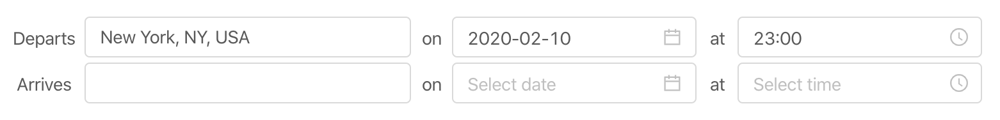
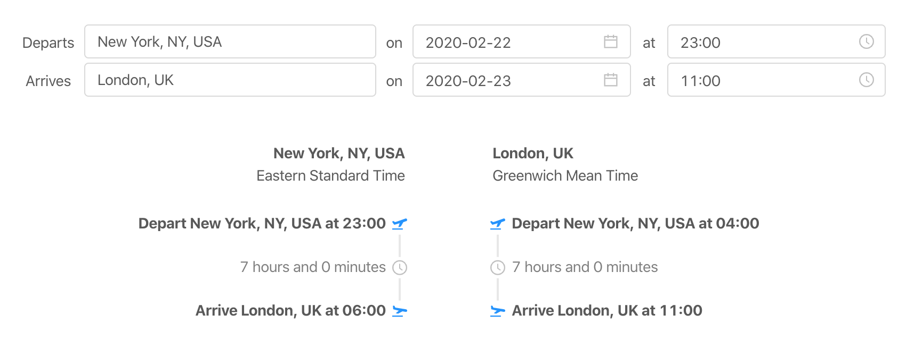

# jet-lag

🛩🕰😴

Your flight from New York to London takes of at **11pm EST** and lands at **11am UK time**. These times are great for logistics, but not very helpful for judging jet lag. Would you be better off with a later or earlier flight? Will you be waking up at 11am or 6am?

**jet-lag** quickly shows you your take-off and landing times at both your origin and destination.

[Working demo 🎉](https://corinm.github.io/jet-lag)

## Table of Contents

- [Getting Started](#getting-started)
  - [Prerequisites](#prerequisites)
  - [Installation](#installation)
- [Usage](#usage)
- [Roadmap](#roadmap)
- [Acknowledgements](#acknowledgements)

## Getting Started

To get a local copy up and running follow these simple example steps.

### Prerequisites

You will need

- [Node.js and npm](https://nodejs.org/en/download/)
- [Running instance of the jet-lag-server](https://github.com/corinm/jet-lag-server)

### Installation

1. Clone the repo

```sh
git clone https://github.com/corinm/jet-lag.git
```

2. Install dependencies

```sh
npm install
```

3. Start on localhost:3000

```sh
npm start
```

## Usage

1. Enter departure and arrival cities, dates and times.
   

2. Timelines of your journey will automatically load
   

## Roadmap

See the [open issues](https://github.com/corinm/jet-lag/issues) for a list of proposed features (and known issues).

## Acknowledgements

- [dbader/readme-template](https://github.com/dbader/readme-template)
- [othneildrew/Best-README-Template](https://github.com/othneildrew/Best-README-Template)
- [useDebounce hook by Gabe Ragland](https://usehooks.com/useDebounce/)
